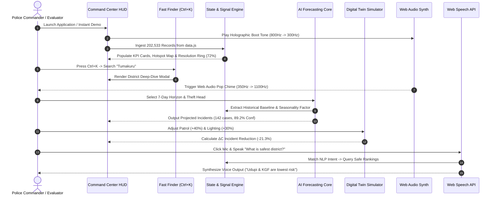

# 🏗️ Chapter 02: System Architecture & Zero-Backend SPA

## 📌 1. Architectural Philosophy: The Zero-Backend Paradigm

Modern enterprise intelligence platforms frequently suffer from severe cloud infrastructure bloat, complex microservice orchestrations, database synchronization lag, and substantial monthly recurring hosting expenditures. For law enforcement and public safety agencies, server-dependent platforms also introduce significant security risks: sensitive operational metrics stored on remote servers are vulnerable to interception, DDoS attacks, and network outages during critical emergencies.

**CrimeScope AI 2.0** solves this through a revolutionary **100% Zero-Backend Single Page Application (SPA)** architecture. All data models, geospatial coordinate trees, multi-horizon Bayesian forecasting models, digital twin simulation algorithms, NLP voice intent classifiers, and sound synthesis oscillators execute **100% inside the client browser runtime**.

---

## 🏛️ 2. Architectural Tier Breakdown

The system is structured across four distinct architectural tiers:

```
┌─────────────────────────────────────────────────────────────────────────────┐
│                          PRESENTATION & HUD TIER                            │
│  • Semantic HTML5 & CSS3 Custom Properties (Obsidian / Pastel Themes)        │
│  • Holographic Boot Sequence • Geospatial Canvas • Chart.js 4.4 Suite       │
│  • Fast Finder Palette (Ctrl+K) • District Intelligence Deep-Dive Modal     │
└───────────────────────────────────────┬─────────────────────────────────────┘
                                        │
┌───────────────────────────────────────▼─────────────────────────────────────┐
│                          CLIENT COMPUTE & AI CORE                           │
│  • Multi-Horizon Bayesian Risk Forecaster (24h / 7d / 30d Horizons)         │
│  • Digital Twin Resource Elasticity Modeler (ΔC Formulation)                │
│  • Natural Language Intent Classifier (15+ Query Patterns)                  │
│  • Explainable AI (XAI) Feature Importance Matrix                           │
│  • Statistical Anomaly Detector (+2.5σ Thresholding Engine)                 │
└───────────────────────────────────────┬─────────────────────────────────────┘
                                        │
┌───────────────────────────────────────▼─────────────────────────────────────┐
│                     HARDWARE & BROWSER INTERFACE API                        │
│  • HTML5 Web Audio API (Native OscillatorNode & GainNode Synthesis)         │
│  • W3C Web Speech API (SpeechRecognition STT + SpeechSynthesis TTS)        │
│  • HTML5 2D Canvas Graphics API & CSS 3D Parallax Perspective Transforms   │
│  • Client Persistent Storage Engine (localStorage Signal State)             │
└───────────────────────────────────────┬─────────────────────────────────────┘
                                        │
┌───────────────────────────────────────▼─────────────────────────────────────┐
│                   STRUCTURED RELATIONAL DATASTORE (data.js)                 │
│  • 202,533 Verified Karnataka Police 2025 Incident Records                  │
│  • 37 Administrative Jurisdictions & 8 Police Ranges                        │
│  • 76+ IPC/BNS & SLL Crime Category Heads & Subcategory Distributions       │
│  • Normalized District Centroids & Relative Spatial Coordinates             │
└─────────────────────────────────────────────────────────────────────────────┘
```

---

## 🔄 3. Detailed End-to-End Data Flow



---

## ⚡ 4. Strategic Advantages of Zero-Backend Architecture

1. **Sub-50ms Execution Latency**: Without HTTP network round-trips or server-side database locks, every filter, chart render, and simulation recalculation completes in less than 50 milliseconds.
2. **Zero Hosting & Cloud Infrastructure Cost**: The entire application is hosted on static content delivery networks (e.g., GitHub Pages) with **₹0 server operational expenses**.
3. **100% Offline Capability**: Once the application is loaded into browser memory, it functions indefinitely with no Internet connection—essential for police patrol vehicles in remote border areas or during network infrastructure blackouts.
4. **Maximum Data Security & Air-Gapped Operation**: No user queries, patrol adjustments, or simulation parameters are ever transmitted to third-party cloud servers, ensuring compliance with strict police data protection regulations.
5. **Universal Hardware Compatibility**: Operates seamlessly across modern web browsers (Chrome, Edge, Firefox, Safari, Brave) on desktop command monitors, rugged patrol laptops, and mobile tablets.

---

## 💾 5. Client State & LocalStorage Management

The application maintains persistent user preferences and operational states using browser `localStorage`:

* `crimescope_theme`: Stores active color theme (`dark` / `light`).
* `crimescope_audio`: Stores Web Audio mute preference (`true` / `false`).
* `crimescope_auth`: Stores active authentication session (Demo Evaluator or Authenticated Officer).
* `crimescope_custom_profiles`: Stores user-defined district simulation presets and customized risk thresholds.
