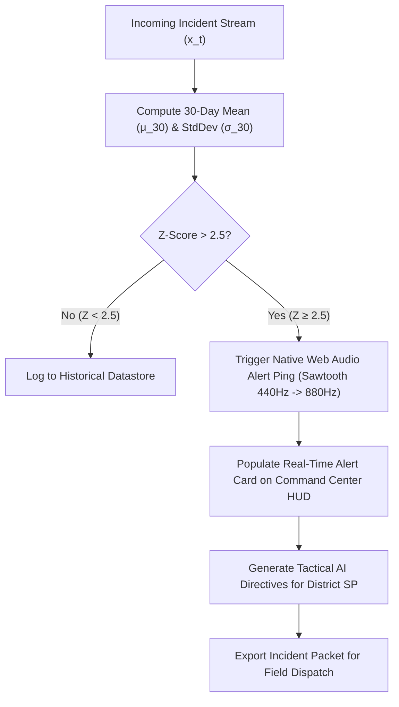

# 🚨 Chapter 08: Real-Time Anomaly Detector & Incident Alerts

## 📌 1. The Anomaly Detection Imperative

Crime trends do not develop uniformly; localized crime spikes frequently occur due to active organized criminal syndicates, sudden seasonal population shifts, or unexpected infrastructure disruptions. Identifying these statistical surges in real time allows police commanders to dispatch rapid-response taskforces before patterns solidify into prolonged crime waves.

The **CrimeScope AI 2.0 Incident Alert Center** continuously monitors incoming incident streams against historical moving baselines, issuing automated tactical warnings when deviations exceed statistical thresholds.

---

## 📊 2. Statistical $+2.5\sigma$ Thresholding Formula

An alert is classified as an **Operational Anomaly** if the recorded incident frequency $x_t$ over a sliding time window $t$ diverges from the 30-day moving average $\mu_{30}$ by more than $2.5$ standard deviations ($\sigma_{30}$):

$$Z = rac{x_t - \mu_{30}}{\sigma_{30}} > 2.5$$

```
Statistical Anomaly Classification Matrix
┌───────────────────┬───────────────────┬──────────────┬──────────────────────────────┐
│ Standard Score (Z)│ Severity Tier     │ Visual Badge │ Action Protocol              │
├───────────────────┼───────────────────┼──────────────┼──────────────────────────────┤
│ Z ≥ 3.5           │ 🔴 CRITICAL SURGE │ Red Glow     │ Immediate taskforce dispatch │
│ 2.5 ≤ Z < 3.5     │ 🟠 HIGH ANOMALY   │ Amber Pulse  │ Patrol frequency +50%        │
│ 1.8 ≤ Z < 2.5     │ 🔵 ADVISORY       │ Blue Outline │ Beat officer heightened vigil│
│ Z < 1.8           │ 🟢 NOMINAL        │ Normal       │ Standard baseline operation  │
└───────────────────┴───────────────────┴──────────────┴──────────────────────────────┘
```

---

## 🚨 3. Live Simulated Incident Stream

```
Incident Anomaly Feed
┌─────────────────────────────────────────────────────────────────────────────┐
│ 🔴 [CRITICAL SURGE · +4.2σ] Two-Wheeler Thefts — Bengaluru City (West Zone) │
│    Deviation: +48.6% above 30-day moving baseline (142 cases in 48h)        │
│    Directive: Deploy ANPR checkpoints at Metro feeder parking hubs.         │
├─────────────────────────────────────────────────────────────────────────────┤
│ 🟠 [HIGH ANOMALY · +2.8σ] UPI Cheating & Cyber Phishing — Mysuru City       │
│    Deviation: +31.2% above baseline (38 complaints in 24h)                  │
│    Directive: Broadcast localized cyber safety SMS advisory via 112.        │
├─────────────────────────────────────────────────────────────────────────────┤
│ 🔵 [ADVISORY · +2.1σ] Night Burglary Cluster — Tumakuru Commercial Hub     │
│    Deviation: +18.4% above baseline (12 residential breaks in 5 days)       │
│    Directive: Intensify nocturnal motorcycle patrols between 01:00 - 04:30.  │
└─────────────────────────────────────────────────────────────────────────────┘
```

---

## 🛠️ 4. Automated Incident Alert Dispatch Workflow


