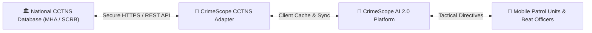

# 🔮 Chapter 20: Future Roadmap & CCTNS Integration

## 📌 1. Multi-Year Innovation Horizon

CrimeScope AI 2.0 is engineered with an extensible modular foundation designed for phased strategic deployment across Karnataka State Police infrastructure:

```
Multi-Year Development Roadmap
┌─────────────────────────────────────────────────────────────────────────────┐
│ 🟢 Phase 1 (v2.0 — Current Datathon Release)                                │
│ • Complete 202,533 Karnataka Police 2025 records integration               │
│ • Digital Twin Resource & Patrol Simulator with ΔC elasticity               │
│ • Multi-Horizon Bayesian Risk Forecaster (24h / 7d / 30d)                   │
│ • Web Speech API NLP Copilot & Native Web Audio Synthesizer                 │
├─────────────────────────────────────────────────────────────────────────────┤
│ 🔵 Phase 2 (v2.5 — Q3 2026 Milestone)                                       │
│ • Real-time RTSP CCTV stream integration with edge anomaly detection        │
│ • Automated Number Plate Recognition (ANPR) cross-district stolen hotlist   │
│ • Drone patrol route optimization for rural forest fringes & Ghat roads     │
├─────────────────────────────────────────────────────────────────────────────┤
│ 🟣 Phase 3 (v2.8 — Q4 2026 Milestone)                                       │
│ • Multilingual Voice Assistant in Kannada (ಕನ್ನಡ) and Hindi (हिन्दी)       │
│ • Dial 112 emergency CAD (Computer Aided Dispatch) API sync                │
│ • Citizen Crime Awareness & Safe Route Navigation Mobile PWA               │
├─────────────────────────────────────────────────────────────────────────────┤
│ 🟡 Phase 4 (v3.0 — Q1 2027 Milestone)                                       │
│ • Direct bidirectional integration with National CCTNS Police Database      │
│ • Blockchain-backed digital chain of custody for cyber forensic evidence    │
│ • Automated Charge-sheet timeline & judicial disposal tracking              │
└─────────────────────────────────────────────────────────────────────────────┘
```

---

## 🏛️ 2. CCTNS Interoperability Architecture (Phase 4)


