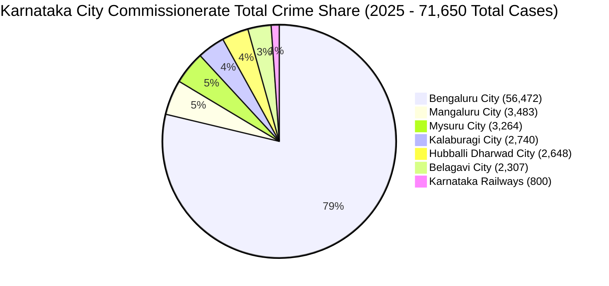
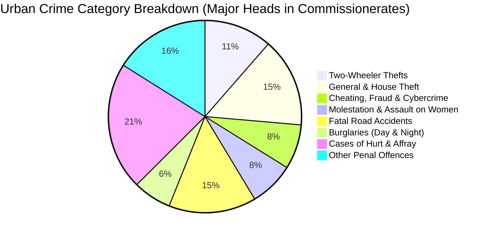
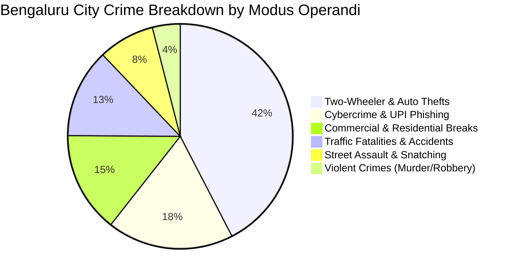
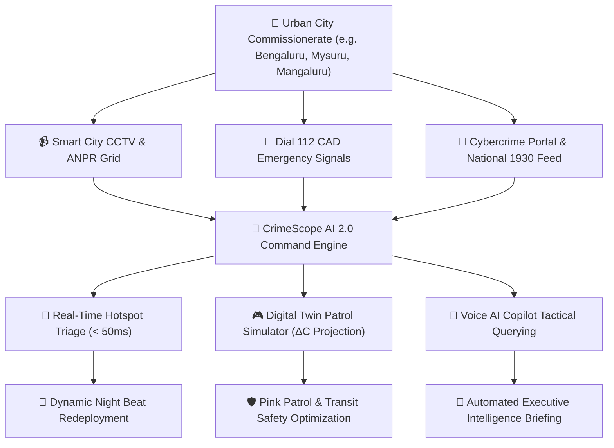

# 🏙️ Chapter 22: City Crime Analysis & Commissionerates (Graphs, Pie Charts & Analytics)

## 📌 1. Urban Law Enforcement Scope in Karnataka

Urban crime management presents a distinct set of operational, demographic, and logistical dynamics compared to rural policing. In Karnataka, high-density metropolitan zones are administered under dedicated **Police Commissionerates** led by Commissioners of Police (ADGP/IGP rank), possessing direct executive magisterial powers.

In 2025, Karnataka's **7 City Commissionerates & Specialized Urban Units** accounted for:
* **46,554 IPC Offences** (33.6% of state IPC total)
* **25,096 Special & Local Laws (SLL) Violations** (39.3% of state SLL total)
* **71,650 Total Urban Incidents** (35.4% of entire state crime volume)

---

## 🥧 2. City Commissionerate Crime Share (Mermaid Pie Charts)

### 📊 Commissionerate Incident Volume Distribution



### 🥧 Urban Crime Category Breakdown Across Cities



### 🥧 Bengaluru Metropolitan Crime Modus Operandi



---

## 📊 3. Comparative Bar Graphs & Visual Analytics

### 📈 City Crime Volume Comparison (IPC vs. SLL)

```
City Incident Volume (Cases)
┌─────────────────────────┬──────────────────────────────────────────────────────────┐
│ Bengaluru City          │ [████████████████████████████████████████] 56,472 Total │
│                         │   IPC: 37,181 █ SLL: 19,291                              │
├─────────────────────────┼──────────────────────────────────────────────────────────┤
│ Mangaluru City          │ [███] 3,483 Total                                        │
│                         │   IPC: 2,278 █ SLL: 1,205                                │
├─────────────────────────┼──────────────────────────────────────────────────────────┤
│ Mysuru City             │ [███] 3,264 Total                                        │
│                         │   IPC: 2,224 █ SLL: 1,040                                │
├─────────────────────────┼──────────────────────────────────────────────────────────┤
│ Kalaburagi City         │ [██] 2,740 Total                                         │
│                         │   IPC: 1,730 █ SLL: 1,010                                │
├─────────────────────────┼──────────────────────────────────────────────────────────┤
│ Hubballi Dharwad City   │ [██] 2,648 Total                                         │
│                         │   IPC: 1,488 █ SLL: 1,160                                │
├─────────────────────────┼──────────────────────────────────────────────────────────┤
│ Belagavi City           │ [██] 2,307 Total                                         │
│                         │   IPC: 1,655 █ SLL: 652                                  │
├─────────────────────────┼──────────────────────────────────────────────────────────┤
│ Karnataka Railways      │ [█] 800 Total                                            │
│                         │   IPC: 662 █ SLL: 138                                    │
└─────────────────────────┴──────────────────────────────────────────────────────────┘
```

### 🎯 Crime Resolution Rate Comparison Across Major Cities

```
City Resolution & Disposal Rate (%)
┌─────────────────────────┬──────────────────────────────────────────┬───────────────┐
│ City Commissionerate    │ Progress Bar                             │ Rate (%)      │
├─────────────────────────┼──────────────────────────────────────────┼───────────────┤
│ 🏰 Mysuru City          │ [███████████████████████████████████░░░] │ 76.5%         │
│ 🌊 Mangaluru City       │ [██████████████████████████████████░░░░] │ 74.8%         │
│ 🚂 Karnataka Railways   │ [██████████████████████████████████░░░░] │ 74.2%         │
│ 🏙️ Hubballi Dharwad City│ [█████████████████████████████████░░░░░] │ 73.1%         │
│ 🏙️ Bengaluru City       │ [████████████████████████████████░░░░░░] │ 71.2%         │
│ 🏰 Belagavi City        │ [████████████████████████████████░░░░░░] │ 70.8%         │
│ ☀️ Kalaburagi City      │ [███████████████████████████████░░░░░░░] │ 69.4%         │
└─────────────────────────┴──────────────────────────────────────────┴───────────────┘
```

---

## 🏛️ 4. Commissionerate Deep-Dive Tactical Dossiers

### 1. 🏙️ Bengaluru City Commissionerate
* **Administrative Scope**: 8 Zones (East, West, North, South, Central, Whitefield, South-East, North-East) covering 13+ Million residents.
* **2025 Incident Metrics**: **37,181 IPC** | **19,291 SLL** | **Total: 56,472** (27.88% of Karnataka total).
* **Risk Score Index**: **98.4 / 100 (Critical Risk)**.
* **Key Tactical Challenges**:
  1. Two-Wheeler Theft (8,860 cases statewide; ~4,100 concentrated in Bengaluru Metro nodes).
  2. Financial Cybercrime & OTP/UPI Fraud (5,839 cases; major IT hubs affected).
  3. Traffic Accidents on Outer Ring Road (ORR) and Elevated Corridors.
* **AI Strategic Directives**:
  * Deploy Automated Number Plate Recognition (ANPR) cameras at all 48 toll and perimeter exit corridors.
  * Saturate Pink Patrol coverage along tech-park bus interchanges between 19:00 and 23:30.
  * Implement night-beat motorcycle sweeps in residential colonies between 01:30 and 04:30.

---

### 2. 🏰 Mysuru City Commissionerate
* **Administrative Scope**: Heritage capital and premier cultural tourism destination covering Devaraja, Krishnaraja, and Narasimharaja subdivisions.
* **2025 Incident Metrics**: **2,224 IPC** | **1,040 SLL** | **Total: 3,264**.
* **Risk Score Index**: **55.2 / 100 (Moderate Risk)**.
* **Key Tactical Challenges**:
  1. High seasonal influx during Dasara festival (surge multiplier $E_f = 1.35$).
  2. Tourist area pickpocketing and luggage theft near Palace and Chamundi Hill.
  3. Inter-district highway transit towards Kerala and Tamil Nadu.
* **AI Strategic Directives**:
  * Establish specialized Tourist Police Helpdesks at heritage transit zones.
  * Integrate temporary mobile CCTV towers during festival quarters.
  * Maintain speed radar interceptors on Mysuru-Bengaluru Expressway connectors.

---

### 3. 🌊 Mangaluru City Commissionerate
* **Administrative Scope**: Coastal maritime hub, international shipping port, and major educational nexus.
* **2025 Incident Metrics**: **2,278 IPC** | **1,205 SLL** | **Total: 3,483**.
* **Risk Score Index**: **57.4 / 100 (Moderate Risk)**.
* **Key Tactical Challenges**:
  1. Coastal transport corridors and maritime port perimeter security.
  2. Communal sensitivity requiring proactive dispute mediation.
  3. Interstate narcotics and contraband smuggling checks (Kerala border).
* **AI Strategic Directives**:
  * Establish joint maritime-police coastal checkposts along Panambur and Tannirbhavi beaches.
  * Deploy automated facial recognition cameras at interstate bus and rail terminals.
  * Fast-track social media grievance monitoring to prevent viral disinformation.

---

### 4. 🏙️ Hubballi-Dharwad City Commissionerate
* **Administrative Scope**: North Karnataka's premier commercial and industrial twin-city trade hub.
* **2025 Incident Metrics**: **1,488 IPC** | **1,160 SLL** | **Total: 2,648**.
* **Risk Score Index**: **34.8 / 100 (Safe Tier)**.
* **Key Tactical Challenges**:
  1. Railway junction commercial theft and transit luggage lifting.
  2. APMC market yard financial disputes and goods theft.
* **AI Strategic Directives**:
  * Intensify round-the-clock foot beats across Old Hubballi and Dharwad Market areas.
  * Implement unified CCTV monitoring linked directly to the Commissionerate Control Room.

---

### 5. 🏰 Belagavi City Commissionerate
* **Administrative Scope**: Northern border commercial center and military cantonment zone.
* **2025 Incident Metrics**: **1,655 IPC** | **652 SLL** | **Total: 2,307**.
* **Risk Score Index**: **47.1 / 100 (Moderate Tier)**.
* **Key Tactical Challenges**:
  1. Interstate movement along the Maharashtra border (NH-48 corridor).
  2. Industrial estate property theft and nocturnal commercial breaks.
* **AI Strategic Directives**:
  * Joint border barricading with Maharashtra Police at Koganoli and Shinoli checkpoints.
  * High-visibility motorcycle patrols during commercial market closure hours.

---

### 6. ☀️ Kalaburagi City Commissionerate
* **Administrative Scope**: North-Eastern regional headquarters and commercial nexus.
* **2025 Incident Metrics**: **1,730 IPC** | **1,010 SLL** | **Total: 2,740**.
* **Risk Score Index**: **51.1 / 100 (Moderate Tier)**.
* **Key Tactical Challenges**:
  1. High seasonal temperature variance impacting altercation rates.
  2. Property dispute mediation and suburban agricultural boundary friction.
* **AI Strategic Directives**:
  * Preventive beat-officer mediation for civil and property disputes.
  * Specialized cyber awareness camps in educational colleges and universities.

---

### 7. 🚂 Karnataka Railways Police Commissionerate
* **Administrative Scope**: Statewide specialized railway jurisdiction covering 3,000+ km of rail tracks, 300+ stations, and passenger trains.
* **2025 Incident Metrics**: **662 IPC** | **138 SLL** | **Total: 800**.
* **Risk Score Index**: **18.5 / 100 (Safe Tier)**.
* **Key Tactical Challenges**:
  1. Night train passenger luggage theft and phone snatching at signals.
  2. Missing children and human trafficking detection at major junction platforms.
* **AI Strategic Directives**:
  * Armed escort parties on all night express trains passing through high-theft corridors.
  * AI facial recognition matching at KSR Bengaluru, Yesvantpur, and Hubballi junctions.

---

## 🧮 5. Urban Density Multiplier Formulation ($U_m$)

Urban crime models in CrimeScope AI 2.0 apply an **Urban Density Multiplier ($U_m$)** to account for transit velocity, population concentration, and anonymous commercial footfalls:

$$U_m = 1.0 + lpha \cdot \log_{10}\left(rac{	ext{PopDensity}_d}{	ext{StateDensity}_{	ext{avg}}}
ight) + eta \cdot \left(rac{	ext{CommercialTransit}_d}{100}
ight)$$

Where:
* $lpha = 0.35$ (Urban density elasticity coefficient).
* $eta = 0.20$ (Transit and commercial hub weighting).
* Result: Bengaluru City exhibits $U_m = 1.62$, while rural districts exhibit $U_m pprox 0.85 - 1.05$.

---

## 🗺️ 6. Urban Smart Policing Flowchart


