# 🔵 CrimeScope AI 2.0 — Official Documentation Hub

<div align="center">


### **Next-Generation AI Crime Intelligence & Predictive Policing Platform for Karnataka State**

[](https://datathon2026.com)
[](https://ranjeet7680.github.io/Al-Driven-Crime-Analytics-Visualization-Platform/)
[](https://data.gov.in)
[](06-AI-Prediction-Engine-&-Mathematical-Formulas)
[](02-System-Architecture-&-Zero-Backend-SPA)
[](13-Design-System,-Themes-&-Accessibility)
[](https://github.com/Ranjeet7680/Al-Driven-Crime-Analytics-Visualization-Platform/blob/main/LICENSE)

> **PREDICT · PREVENT · PROTECT**  
> *Empowering Karnataka law enforcement with real-time geospatial intelligence, multi-horizon AI risk forecasting, and digital twin simulation across 202,533 verified crime records.*

[🚀 Launch Live Platform](https://ranjeet7680.github.io/Al-Driven-Crime-Analytics-Visualization-Platform/) • [📖 Master Handbook PDF](https://github.com/Ranjeet7680/Al-Driven-Crime-Analytics-Visualization-Platform/raw/main/CrimeScope_AI_2.0_Comprehensive_Handbook_eBook.pdf) • [🏗️ Architecture](02-System-Architecture-&-Zero-Backend-SPA) • [📊 2025 Data](03-Karnataka-Police-2025-Dataset-&-Data-Dictionary) • [🏙️ City Analysis](22-City-Crime-Analysis-&-Commissionerates) • [👨‍💻 Team](21-Team-INNOVATOR-&-Datathon-2026-Alignment)

</div>

---

## 🌟 Welcome to the CrimeScope AI 2.0 Wiki

Welcome to the comprehensive technical documentation and operational knowledge base for **CrimeScope AI 2.0**. Engineered for **Datathon 2026**, this platform transforms static historical police records into live, proactive tactical intelligence for Karnataka's state leadership, Range DIGs, and Superintendent of Police (SP) offices.

Built upon **202,533 verified crime incidents** from the **Karnataka Police Annual Statistics Report (2025)** spanning **37 districts, commissionerates, and ranges**, CrimeScope AI 2.0 introduces mathematical Digital Twin simulation, multi-horizon Bayesian risk forecasting, natural language voice copilot interaction, and mathematical Web Audio feedback—all functioning in a **100% Zero-Backend Single Page Application (SPA)**.

---

## 📊 Platform Core Metrics at a Glance

| Metric | Official 2025 Value | Operational Significance |
|---|:---:|---|
| **Total Verified Incidents** | **202,533** | 138,666 IPC offences + 63,867 Special & Local Law (SLL) cases |
| **Jurisdictions Covered** | **37** | 6 Major Commissionerates + 31 Revenue Districts across 8 Ranges |
| **City Commissionerate Crimes** | **71,650 (35.4%)** | Concentrated across 7 major urban police commissionerates |
| **AI Model Confidence** | **89.2%** | Validated across temporal holdout cross-validation sets |
| **Crime Resolution Rate** | **72.0%** | Comprehensive tracking of state-level case disposal |
| **Client Query Velocity** | **< 50ms** | Instant sub-second calculation on client browser hardware |
| **Backend Server Footprint** | **0 KB (Zero Backend)** | No servers, no database costs, 100% offline-capable, zero latency |
| **Accessibility Compliance** | **WCAG 2.1 AA** | High-contrast Obsidian & Pastel themes with full keyboard control |

---

## 📚 Complete Wiki Documentation Index

Explore the comprehensive 22-chapter technical dossier below:

```
CrimeScope AI 2.0 Documentation Hierarchy
├── 📌 Strategic Foundations
│   ├── [01. Executive Summary](01-Executive-Summary) — Context, mission, KPIs & comparative analysis
│   ├── [02. System Architecture & Zero-Backend SPA](02-System-Architecture-&-Zero-Backend-SPA) — Component data flow & client-side state
│   ├── [03. Karnataka Police 2025 Dataset](03-Karnataka-Police-2025-Dataset-&-Data-Dictionary) — 202,533 records, range breakdowns & schemas
│   └── [04. Interactive Features Catalog](04-Interactive-Features-Catalog) — Deep-dive into all 14 core UI/UX modules
│
├── 🧠 AI, Mathematics & Simulation
│   ├── [05. Geospatial Hotspot Intelligence](05-Geospatial-Hotspot-Intelligence-&-Map-Engine) — Animated radar waves & quantile risk mapping
│   ├── [06. AI Prediction Engine & Math](06-AI-Prediction-Engine-&-Mathematical-Formulas) — Bayesian forecasting & multi-horizon algorithms
│   ├── [07. Digital Twin Policing Simulator](07-Digital-Twin-Policing-Simulator) — Resource elasticity formulas & scenario modeling
│   ├── [08. Real-Time Anomaly Detector](08-Real-Time-Anomaly-Detector-&-Incident-Alerts) — +2.5σ statistical surge alerts & deviations
│   ├── [09. AI Crime Copilot & Voice UI](09-AI-Crime-Copilot-&-Voice-Speech-Interface) — Web Speech NLP & hands-free police operation
│   └── [10. Explainable AI (XAI) Framework](10-Explainable-AI-(XAI)-&-Feature-Attribution) — Factor decomposition & transparency matrices
│
├── 🛡️ Operations, Demographics & Urban Analysis
│   ├── [11. Vulnerable Demographics & Safety](11-Vulnerable-Demographics-&-Women-Safety-Analytics) — Women (Pink Patrol), children & highway safety
│   ├── [12. Native Web Audio Synthesizer](12-Native-Web-Audio-Synthesizer-Engine) — Mathematical sound synthesis with zero MP3 assets
│   ├── [13. Design System & Accessibility](13-Design-System,-Themes-&-Accessibility) — Obsidian/Pastel themes, 3D tilt & WCAG AA
│   ├── [14. 37-District Tactical Atlas](14-37-District-Tactical-Atlas-&-Intelligence-Profiles) — Complete jurisdiction profiles & directives
│   └── [22. City Crime Analysis & Commissionerates](22-City-Crime-Analysis-&-Commissionerates) — Urban crime graphs, pie charts, and city dossiers
│
└── 🚀 Deployment, Operations & Governance
    ├── [15. Installation & Zero-Build Setup](15-Installation,-Deployment-&-Zero-Build-Setup) — Instant demo, local servers & GitHub Pages CI/CD
    ├── [16. Command Center User Manual](16-Command-Center-User-Manual-&-Tactical-SOPs) — Field SOPs & Fast Finder (Ctrl+K) cheat sheet
    ├── [17. Security & Algorithmic Ethics](17-Security,-Data-Privacy-&-Algorithmic-Ethics) — Zero PII, bias elimination & client sandboxing
    ├── [18. Financial Feasibility & TCO](18-Financial-Feasibility-&-TCO-Comparison) — Zero-server cost vs ₹2.5Cr legacy enterprise TCO
    ├── [19. Troubleshooting & FAQ](19-Troubleshooting-&-Frequently-Asked-Questions) — Browser compatibility & microphone/audio setup
    ├── [20. Future Roadmap & CCTNS](20-Future-Roadmap-&-CCTNS-Integration) — CCTV RTSP edge AI, Kannada NLP & CCTNS bridge
    └── [21. Team INNOVATOR & Rubric](21-Team-INNOVATOR-&-Datathon-2026-Alignment) — Team profiles & Datathon 2026 evaluation matrix
```

---

## 🏗️ High-Level System Architecture Preview

```mermaid
flowchart TD
    subgraph DataLayer["📁 Empirical Data Layer (Karnataka Police 2025)"]
        D1["202,533 Verified Incidents"]
        D2["37 Administrative Jurisdictions"]
        D3["76+ Crime Category Heads"]
        D4["Temporal & Seasonal Metrics"]
    end

    subgraph StateEngine["⚙️ State & Signal Engine (data.js & localStorage)"]
        S1["Geospatial Boundary Coordinates"]
        S2["Risk Scoring & Quantile Normalizer"]
        S3["Client Storage: Theme, Audio, Preferences, Profiles"]
    end

    subgraph CoreEngines["🧠 AI, Simulation & Voice Core (app.js)"]
        A1["Multi-Horizon AI Prediction Engine (24h / 7d / 30d)"]
        A2["Digital Twin Resource & Patrol Simulator"]
        A3["NLP AI Copilot (15+ Query Patterns & Context Engine)"]
        A4["Explainable AI (XAI) Feature Importance Matrix"]
        A5["Web Speech API (Speech Recognition + Speech Synthesis)"]
        A6["HTML5 Web Audio API Synthesizer (Native Oscillators)"]
    end

    subgraph UIModule["🎨 User Interface & Presentation Layer (index.html & style.css)"]
        UI1["Cinematic Holographic Boot Sequence"]
        UI2["Overview Command Center (KPIs + Resolution Ring)"]
        UI3["Geospatial Crime Hotspot Map (Animated Radar Waves)"]
        UI4["District Deep-Dive Intelligence Modal"]
        UI5["Fast Finder Global Command Palette (Ctrl+K)"]
        UI6["Interactive Chart.js Suite (Bar, Line, Stacked, Donut)"]
        UI7["Real-Time Incident Alert Center"]
        UI8["Executive Brief Report Exporter (JSON & Printable)"]
    end

    DataLayer --> StateEngine
    StateEngine --> CoreEngines
    CoreEngines --> UIModule
```



---

## ⚡ Instant Evaluator Quick-Start

To evaluate the live prototype immediately:
1. Visit the [Live Production Deployment](https://ranjeet7680.github.io/Al-Driven-Crime-Analytics-Visualization-Platform/).
2. Click **⚡ Instant Demo Access** on the landing page or login modal.
3. You will immediately bypass authentication and gain full access to all 14 intelligence modules, the Digital Twin sandbox, the voice copilot, and data export engines.

For detailed local setup and developer instructions, see [Chapter 15: Installation & Zero-Build Setup](15-Installation,-Deployment-&-Zero-Build-Setup).
