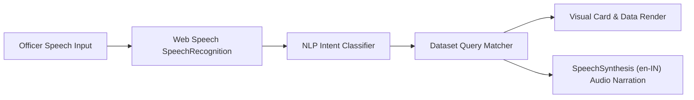

# 🤖 AI Copilot & Voice Speech Assistant Architecture

---

## 🎙️ Voice & Speech Pipeline

---

## 💬 Sample Query Benchmarks

| Officer Voice Query | Interpreted Intent | Copilot Response Extract |
|---|---|---|
| *"Which district is safest in Karnataka?"* | Safety Ranking | *"Kolar Gold Fields (KGF) and Chamarajanagar recorded the lowest crime volumes..."* |
| *"Show crime trend in Bengaluru"* | District Diagnostics | *"Bengaluru City recorded 37,181 IPC crimes (26.8% state share) with 8,860 bike thefts..."* |
| *"How many fatal road accidents occurred in 2025?"* | Metric Inquiry | *"Karnataka recorded 11,408 fatal road accidents in 2025 (4,097 on Other Roads, 3,842 on NH)..."* |
