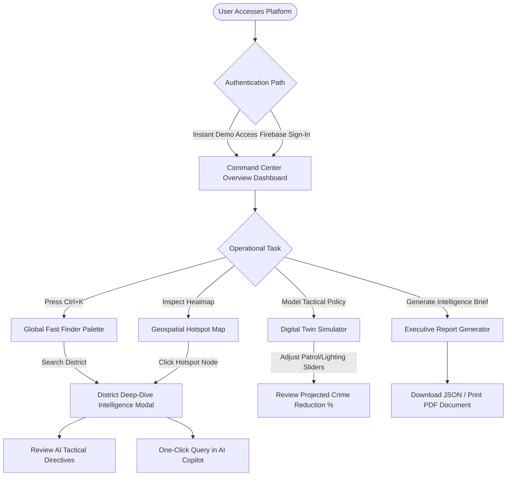
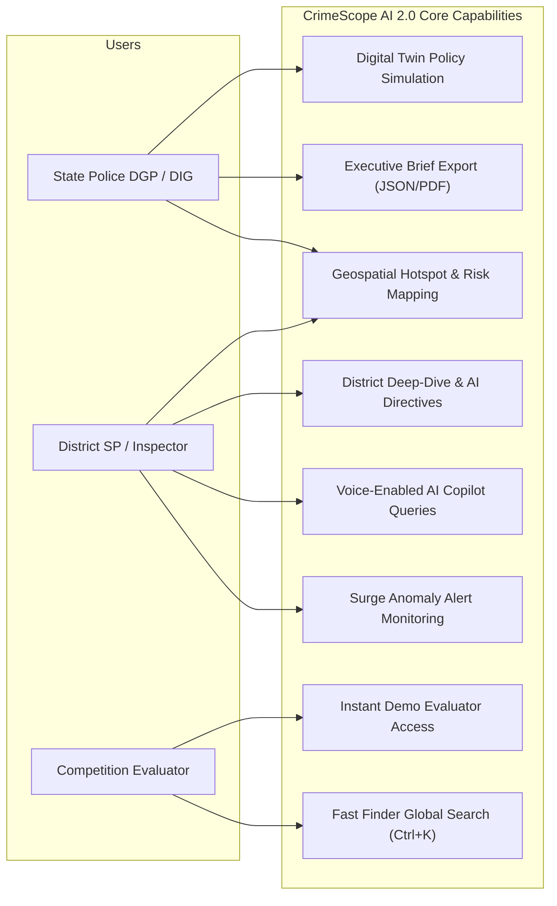
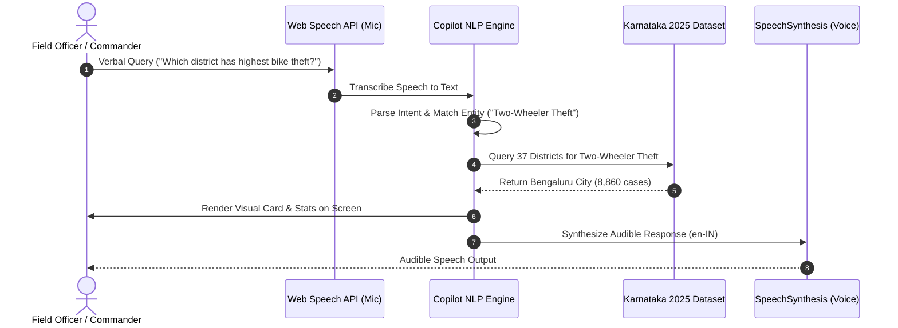

# 🔄 Process Flow, Use-Case & Sequence Diagrams

---

## 1. End-to-End Operational Process Flow

```mermaid
flowchart TD
    A(["User Accesses Platform"]) --> B{"Authentication Path"}
    B -->|"Instant Demo Access"| C["Command Center Overview Dashboard"]
    B -->|"Firebase Sign-In"| C

    C --> D{"Operational Task"}

    D -->|"Press Ctrl+K"| E["Global Fast Finder Palette"]
    E -->|"Search District"| F["District Deep-Dive Intelligence Modal"]

    D -->|"Inspect Heatmap"| G["Geospatial Hotspot Map"]
    G -->|"Click Hotspot Node"| F

    F --> H["Review AI Tactical Directives"]
    F --> I["One-Click Query in AI Copilot"]

    D -->|"Model Tactical Policy"| J["Digital Twin Simulator"]
    J -->|"Adjust Patrol/Lighting Sliders"| K["Review Projected Crime Reduction %"]

    D -->|"Generate Intelligence Brief"| L["Executive Report Generator"]
    L --> M["Download JSON / Print PDF Document"]
```

---

## 2. Role-Based Use-Case Diagram

```mermaid
graph LR
    subgraph Users
        DGP["State Police DGP / DIG"]
        SP["District SP / Inspector"]
        Judge["Competition Evaluator"]
    end

    subgraph PlatformScope["CrimeScope AI 2.0 Core Capabilities"]
        UC1["Instant Demo Evaluator Access"]
        UC2["Geospatial Hotspot & Risk Mapping"]
        UC3["District Deep-Dive & AI Directives"]
        UC4["Voice-Enabled AI Copilot Queries"]
        UC5["Digital Twin Policy Simulation"]
        UC6["Surge Anomaly Alert Monitoring"]
        UC7["Executive Brief Export (JSON/PDF)"]
        UC8["Fast Finder Global Search (Ctrl+K)"]
    end

    Judge --> UC1
    Judge --> UC8
    SP --> UC2
    SP --> UC3
    SP --> UC4
    SP --> UC6
    DGP --> UC5
    DGP --> UC7
    DGP --> UC2
```

---

## 3. Interactive Copilot & Voice Sequence Flow

```mermaid
sequenceDiagram
    autonumber
    actor Officer as Field Officer / Commander
    participant Mic as Web Speech API (Mic)
    participant Core as Copilot NLP Engine
    participant DB as Karnataka 2025 Dataset
    participant Audio as SpeechSynthesis (Voice)

    Officer->>Mic: Verbal Query ("Which district has highest bike theft?")
    Mic->>Core: Transcribe Speech to Text
    Core->>Core: Parse Intent & Match Entity ("Two-Wheeler Theft")
    Core->>DB: Query 37 Districts for Two-Wheeler Theft
    DB-->>Core: Return Bengaluru City (8,860 cases)
    Core->>Officer: Render Visual Card & Stats on Screen
    Core->>Audio: Synthesize Audible Response (en-IN)
    Audio-->>Officer: Audible Speech Output
```
