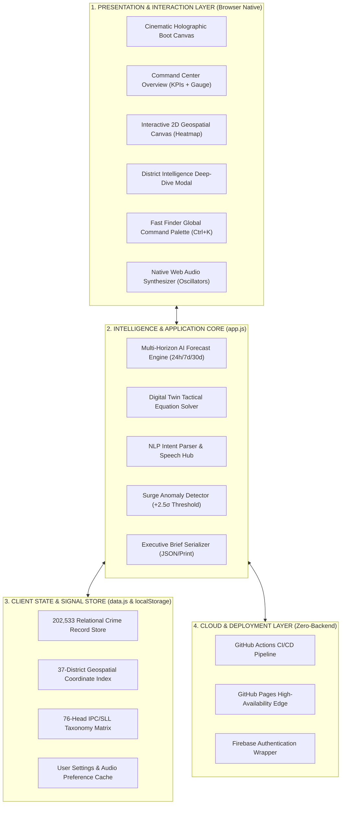

# 🏗️ Architecture Diagram & Engineering Design

---

## 1. 4-Tier Layered System Architecture

---

## 2. Technical Design Principles

1. **Zero Server Dependency (Edge-First):** Complete dataset packaging enables lightning-fast client query execution without network roundtrips.
2. **Deterministic Mathematical Solvers:** Digital Twin simulation and AI forecasting execute via deterministic mathematical models without external API token dependencies.
3. **WCAG AA Compliance:** High-contrast text ratios, tactile sound feedback, screen reader hooks, and keyboard navigability ensure accessibility for all personnel.
